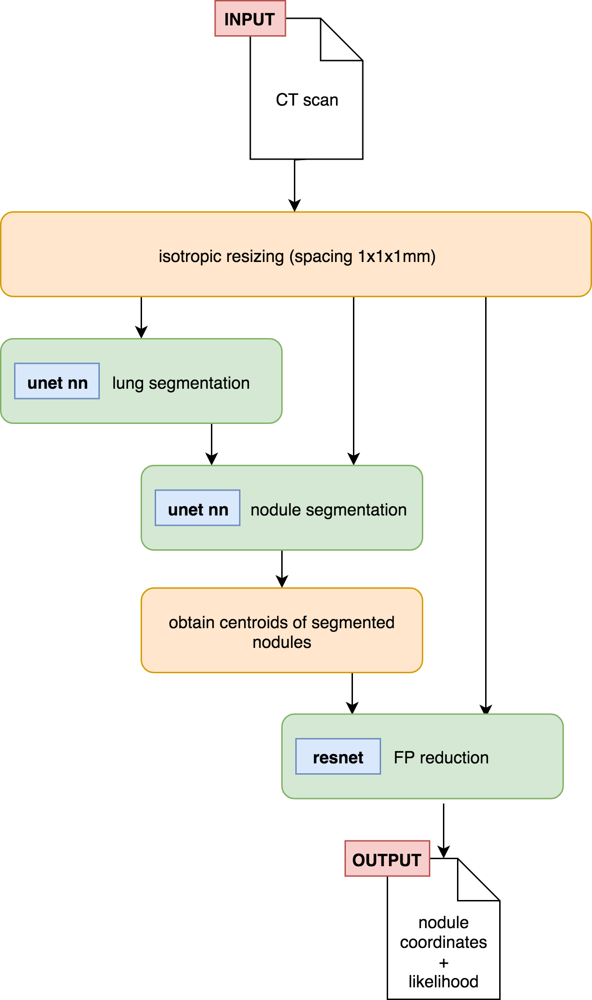

# Integrating the CAD pipeline

Even though there has been much effort in developing new techniques to improve the performance of CAD systems due to the availability of annotated datasets and challenges (NLST, ISBI, LUNA, DSB2017), the published systems tend to be brittle and very much focused on demonstrating good results on those specific challenges but useless as an integrated system. Also, what is not available tends to be proprietary systems, which might be good, but who knows really.

{ width=40% }

One of the improvements that I wanted to bring to the state of the art was to prepare a system which could be easily deployed in a real system. To achieve this I had to automate the scan preprocessing and prepare a full pipeline that could later on be integrated in a real system. In fact, this integration with a system has been performed by Albert <!--TODO put ref -->, that has a queue which picks up the scan and returns a CSV with the annotated nodules to check for.

What do we need to do:

- preprocessing: basically reading the ct scan in a SimpleITK compatible format and rescale it to 1x1x1mm
- lung segmentation: using the input from before, segment the lung and get a segmentation mask
- nodule segmentation: using the isotropic scan and the lung segmentation, compute the segmentation mask for the nodules, then measure the centroids of the labels and convert those coordinates to real world coordinates.
- fp reduction: Using the scan and the centroids in the previous step, apply the nodule classifier and retrieve a probability for each of the nodules. Once we have this probability per candidate, discard any that are below a required threshold. If instead of using a probability threshold what we are interested is in a false positive rate, use the numbers in the evaluation phase to basically determine how the probability maps to a specific FPR, and adjust the output candidates with that.

To run this basically I've packaed everything in a conda environment. This has allowed me to list all the necessary packages and provide an easy way to create environments with all the necessary dependencies, even stuff like CUDA libraries, which is not native python, can be easily installed using conda. This also makes it very easy to then create a Docker image that has all the necessary packages to run this stuff.

What else? Well, the docker image contains the weights of the different neural networks. I've basically just included the best network for each of the steps, based on the evaluation of the results. Both the code, dependencies and weights is included in a Docker image, which can also have GPU support (very much recommended) by using [nvidia-docker](https://github.com/NVIDIA/nvidia-docker).

Once that is built, we have a ready to go image, which only needs to mount 2 volumes (folders) for the input image and the output result. Then it's just a matter of running a command and all of this code can be easily run. Apart from the ease in reproducibility (not only the final script can be executed, but everything else, such as evaluation scripts and the like), we gain a very convenient way to distribute the results and an even better way to test our system in other datasets with minimum hassle, since the whole pipeline has been integrated.

Currently on an i7 7700, 32GB of RAM, GTX 1080Ti, evaluating a scan from start to finish requires around 2mins of processing time.

<!--TODO basically put some real numbers and also put an example of the comand and mention how big the image would be for all of this to work. Break down the results step by step as well (performance wise) -->
